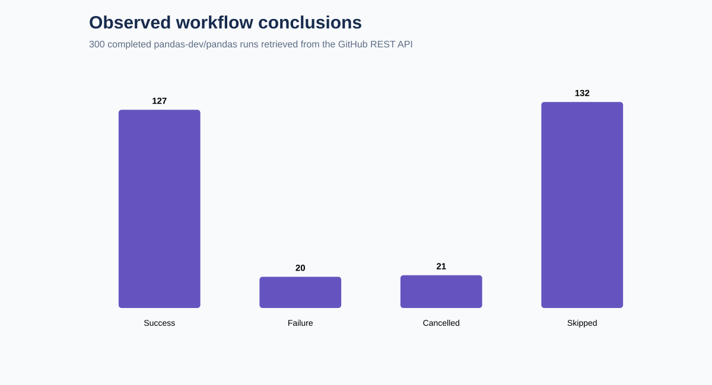
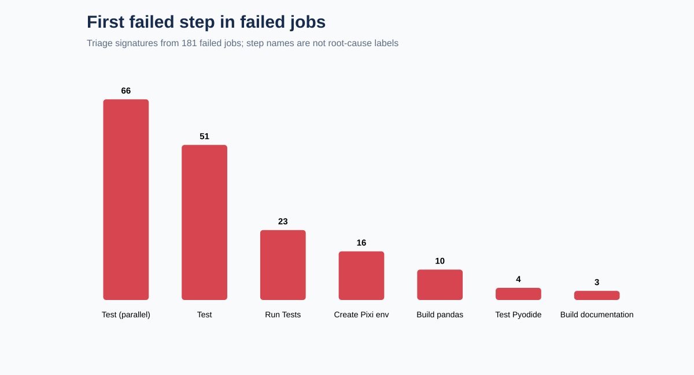

# CI Failure Intelligence

An evidence-based CI observability project built from **300 public GitHub Actions runs** in `pandas-dev/pandas`. It converts workflow and matrix-job metadata into a reproducible reliability snapshot without downloading private data or inventing failure narratives.

Source: [GitHub REST API for workflow runs](https://docs.github.com/en/rest/actions/workflow-runs). Every run links back to GitHub; the acquisition manifest records all endpoints, retrieval time, counts, and SHA-256 hashes.

## What it answers

- How much of the observed CI workload succeeds, fails, cancels, or skips?
- Which workflows account for the most failed runs?
- Which step names are the earliest visible failure point across matrix jobs?
- How long do decisive runs take, without letting near-zero skipped runs distort the distribution?

## Snapshot findings

The snapshot contains 127 successful, 20 failed, 21 cancelled, and 132 skipped runs. Among the 147 decisive runs (success or failure), the observed failure rate was **13.61%**. This is a sample proportion, not a long-term pandas reliability claim.

Decisive runs had an observed median elapsed duration of **11.07 minutes** and p90 of **49.16 minutes**. Including skipped runs would reduce the median to 0.18 minutes and create a misleading picture, so both distributions remain available in `results/summary.json` while the decisive distribution is used for interpretation.



The 20 failed workflows exposed 430 jobs; 181 jobs concluded in failure. The most frequent first failed steps were `Test (not single_cpu)` (66 jobs), `Test` (51), `Run Tests` (23), and `Create virtual environment with Pixi` (16).



These are triage signatures, not diagnosed root causes. A step named “Test” may fail for unrelated code, environment, dependency, or infrastructure reasons. Logs and commit context would be required for causal classification.

`Unit Tests` had 10 failures among 24 decisive observed runs (41.67%); `Doc Build and Upload` had 5 among 31 (16.13%); `Code Checks` had 3 among 25 (12.00%). Different workflows have different triggers and matrix sizes, so these rates should not be compared as equivalent risk.

## Engineering design

- Acquisition uses the official API through authenticated `gh` requests.
- The snapshot stores only public workflow, job, and step metadata; logs are deliberately excluded.
- Source files are hash-verified before analysis.
- Duplicate run IDs fail validation.
- Skipped and cancelled runs remain distinct from successes and failures.
- Workflow failure rates use only decisive outcomes in the denominator.
- First-failed-step extraction follows step sequence, avoiding arbitrary selection from later cleanup failures.

## Reproduce

```bash
python src/ingest.py        # requires authenticated gh CLI
python -m unittest discover -s tests -v
python src/validate.py
python src/analyze.py
python src/create_charts.py
```

The checked-in snapshot makes validation and analysis reproducible without API access.

## Boundaries

- This is the first three 100-run pages returned at acquisition time, not a random or calendar-stratified sample.
- Active repositories can change between page requests; unique-ID validation detects duplication but cannot make offset pagination atomic.
- Run `updated_at - run_started_at` is an API-level elapsed duration, not billed runner time.
- A failed matrix workflow can produce many failed jobs, so run-level and job-level counts are never combined.
- No root cause, flakiness, ownership, or remediation is asserted without logs and repeated-run evidence.
- No synthetic workflows, failures, logs, or labels are present.

## Repository map

```text
data/raw/          API snapshots and provenance manifest
data/processed/    workflow-level reliability table
results/           aggregate factual measurements
assets/            charts generated from results
src/               acquisition, validation, analysis, visualization
tests/             deterministic logic tests
docs/              method and observed decision record
```
